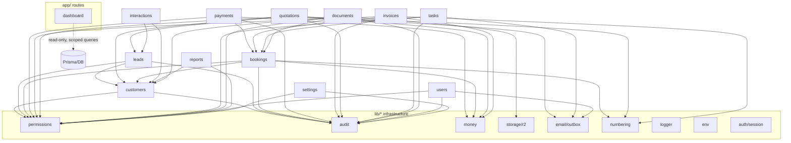
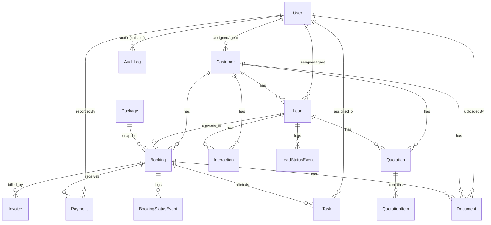

# PROJECT_REVIEW.md — Safar CRM RC1 Final Review

**Date:** 2026-06-20 · **Status:** Release Candidate 1 prep.

> **Binding design lives in [`ARCHITECTURE.md`](./ARCHITECTURE.md)** (goals, decisions, layered rules, module catalog, full RBAC §6). This file is a **generated RC1 review** that consolidates the artifacts the release brief asked for and adds the ones the architecture doc doesn't render explicitly: a **module dependency graph**, a **database ER diagram**, a **server-action inventory**, and an **environment-variable inventory**. Where this file and `ARCHITECTURE.md` differ, `ARCHITECTURE.md` wins.

Companion docs: `SECURITY.md`, `DATABASE_AUDIT.md`, `PERFORMANCE.md`, `OBSERVABILITY.md`, `DEPLOYMENT.md`, `BACKUP.md`, `RUNBOOK.md`, `TESTING.md`, `TEST_MATRIX.md`, `RELEASE_CHECKLIST.md`.

---

## 1. Architecture overview

Modular monolith on Next.js 16 (App Router, TS strict, Turbopack). One strict dependency direction:

```
UI (server/client components)
  → Server Actions  (Zod parse → requireUser → requirePermission → ActionResult)
    → Services      (business logic; takes UserContext; never reads cookies/headers)
      → Repositories(pure data access; soft-delete filter; one per aggregate)
        → Prisma → PostgreSQL (Neon)
```

- **UI never imports Prisma.** UI → server action → service → repository → Prisma.
- **Authorization is in services** (`requirePermission`/`can`), never middleware. Middleware does a cookie-presence gate only.
- **Cross-module calls go service → service** (e.g. payments → bookings → customers), never into another module's repository.
- **Money** is `BigInt` paisa everywhere; **PII** is redacted before logs/Sentry/audit; **mutations** are wrapped in `withAudit` (audit row in the same transaction); **emails** go through a transactional outbox; **documents** are private-R2 + 5-min signed URLs.
- Stack: Tailwind + shadcn/ui · React Hook Form + Zod · TanStack Table · Recharts · Prisma · Better Auth · Cloudflare R2 · Resend · React PDF · Vercel Cron · Sentry · Pino · Vitest + Playwright.

## 2. Folder structure (as built)

```
app/
  (app)/            authenticated routes: dashboard, customers, leads, tasks,
                    bookings, payments, quotations, reports, settings (+ error.tsx,
                    loading.tsx, dashboard/scope.ts)
  api/
    auth/[...all]   Better Auth handler
    cron/*          6 cron routes (bearer CRON_SECRET, idempotent)
    documents/[id]/download   gated download → 5-min signed URL
    healthz         DB-ping health
  login/  layout.tsx  not-found.tsx  global-error.tsx
modules/<name>/     actions.ts · service.ts · repository.ts · schemas.ts · types.ts · (ui)
  auth users customers leads interactions tasks bookings payments
  quotations invoices documents dashboard reports settings
lib/                auth · db · audit · errors · logger · money · phone · storage ·
                    email · numbering · permissions · time · env · charts · hooks · cn
prisma/             schema.prisma · migrations (3) · seed.ts
components/         ui (shadcn) · layout · common
tests/              unit (13) · integration (1) · e2e (3) · stubs
```
Full annotated tree: `ARCHITECTURE.md` §4.

## 3. Module dependency graph

Service → service (business) and module → lib (infrastructure) edges. Repositories are omitted (each module owns exactly one).



Key real edges (verified in code): `payments.service → bookings.service.getBooking` (permission + ownership), `bookings.service → customers.service.getCustomer`, `leads.convert → customers`, `quotations → customers/leads`. No module imports another module's `repository.ts`/`schemas.ts`.

## 4. Database ER diagram

Core relational model (Better Auth `Session/Account/Verification` and ancillary `Package/Settings/EmailOutbox/*StatusEvent` omitted for clarity; all FKs in `DATABASE_AUDIT.md` §5). Money columns are `BigInt` paisa.



Soft delete (`deletedAt`) on Customer/Lead/Booking; OCC `version` on Customer/Lead/Booking/Quotation; refunds are negative PAID `Payment` rows; `AuditLog` is append-only (activate `crm_app` — SECURITY.md §6).

## 5. Permission matrix

The authoritative matrix is `ARCHITECTURE.md` §6.2 and is **machine-checked** by `tests/unit/permissions.test.ts` (every role × permission). Summary:

| Capability area | ADMIN | MANAGER | AGENT | ACCOUNTANT |
|---|---|---|---|---|
| Customers/Leads CRUD | ✅ | ✅ | own only (no delete) | view only |
| Leads assign / convert | ✅ | ✅ | convert own | — |
| Bookings | ✅ | ✅ | own | view |
| Payments record | ✅ | ✅ | own, **cash only** | ✅ |
| Payments refund/void | ✅ | ✅ | — | ✅ |
| Quotations | ✅ | ✅ | own | view |
| Invoices issue/void | ✅ | view | — | ✅ |
| Documents upload | ✅ | ✅ | own | view only |
| Reports (financial) | ✅ | ✅ | **non-financial only** | ✅ (financial only) |
| Users manage | ✅ | — | — | — |
| Settings update | ✅ | view | — | — |
| Audit view | ✅ | ✅ | — | — |

## 6. Server-action inventory (86 actions)

All go through the `serverAction()` wrapper → `requireUser`/`requirePermission` → Zod → service → `ActionResult`. (`auth` exposes sign-in/out via the Better Auth route handler + a session action; `dashboard` is read-only server components, no actions.)

| Module | n | Actions |
|--------|---|---------|
| users | 12 | listAssignableAgents, list, get, profile, create, update, deactivate, reactivate, changeRole, resetPassword, updateProfile, changePassword |
| leads | 11 | create, update, get, list, kanban, changeStatus, assign, delete, restore, convert, history |
| customers | 9 | create, update, delete, restore, get, list, listDeleted, search, import |
| reports | 9 | revenue, leadFunnel, agentPerformance, destination, leadSource, payments, tasks, overview, export |
| bookings | 7 | create, update, changeStatus, cancel, get, list, history |
| documents | 6 | createUploadUrl, confirmUpload, list, update, delete, downloadUrl |
| quotations | 6 | create, update, send, accept, get, list |
| tasks | 6 | create, update, complete, assign, get, list |
| invoices | 5 | create, markPaid, void, get, list |
| interactions | 5 | create, listByLead, listByCustomer, update, delete |
| payments | 5 | record, refund, void, list, balance |
| settings | 5 | get, updateAgency, updateEmail, updateNotifications, testEmail |

## 7. Environment-variable inventory

Source of truth: `lib/env.ts` (Zod-validated at boot; the app refuses to start on invalid env). Mirror in `.env.example`.

| Variable | Required | Used by | Notes |
|----------|----------|---------|-------|
| `NODE_ENV` | default `development` | everywhere | gates Sentry, demo seed |
| `DATABASE_URL` | ✅ | Prisma runtime | Neon **pooled**; connect as `crm_app` in prod |
| `DIRECT_DATABASE_URL` | ✅ | migrations/scripts | Neon **direct** (owner) |
| `BETTER_AUTH_SECRET` | ✅ (≥32) | Better Auth | rotate = log everyone out |
| `BETTER_AUTH_URL` | ✅ | Better Auth (server) | public origin |
| `NEXT_PUBLIC_BETTER_AUTH_URL` | client | `lib/auth/client.ts` | same origin (added this pass) |
| `SENTRY_DSN` / `NEXT_PUBLIC_SENTRY_DSN` | optional | Sentry server/client | prod-only |
| `SENTRY_ORG` / `SENTRY_PROJECT` | optional | source maps | |
| `R2_ACCOUNT_ID` / `R2_ACCESS_KEY_ID` / `R2_SECRET_ACCESS_KEY` / `R2_BUCKET_DOCUMENTS` | prod (documents) | `lib/storage/r2.ts` | private bucket |
| `R2_PUBLIC_HOST` | optional | storage | unused for private flow |
| `RESEND_API_KEY` / `EMAIL_FROM` | prod (email) | `lib/email/outbox.ts` | drain no-ops if unset |
| `CRON_SECRET` | ✅ prod | `/api/cron/*` | Vercel Cron injects as bearer; routes fail closed if unset |
| `LOG_LEVEL` | default `info` | Pino | |
| `SEED_ADMIN_EMAIL` / `SEED_ADMIN_PASSWORD` / `SEED_ADMIN_NAME` | seed only | `prisma/seed.ts` | first admin |

## 8. RC1 readiness snapshot

| Dimension | State |
|-----------|-------|
| Feature complete | ✅ all Phase-1 modules built |
| Tested | ✅ 246 unit/integration green; E2E breadth is the known gap (TEST_MATRIX) |
| Secure | ✅ after this pass (2 high-sev fixed); 1 deploy action: `crm_app` role |
| Observable | ✅ Pino + Sentry (cron + user context added) + AuditLog |
| Mobile responsive | ✅ tables→cards, mobile Playwright project; explicit assertions recommended |
| Deployable | ✅ DEPLOYMENT.md + CI/CD + vercel.json crons |
| Documented | ✅ this review + 10 companion docs |

Outstanding before RC1 sign-off: see `RELEASE_CHECKLIST.md`.
